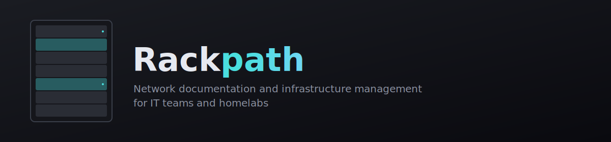

<p align="center">
  
</p>

<p align="center">
  <strong>Network documentation and infrastructure management for IT teams and homelabs</strong>
</p>

<p align="center">
  <a href="LICENSE"></a>
  <a href="https://github.com/Stevy2191/Rackpath/stargazers"></a>
  
</p>

---

## What is Rackpath?

Rackpath is a self-hosted network documentation platform for documenting,
visualizing, and managing IT infrastructure. It brings together network
topology diagrams, visual rack layouts, device inventory, VLAN planning, and
third-party integrations in a single web app — so you always have an
up-to-date picture of what's running where, whether you're managing a
business network or a homelab.

Everything runs in your own environment via Docker Compose: your data never
leaves your infrastructure.

## ✨ Features

- 🗺️ **Interactive Network Topology** — drag-and-drop canvas with animated
  links and interface labels
- 🗄️ **Visual Rack Builder** — front/back views, vendor catalog, multi-rack
  support
- 📋 **Device Inventory** — SNMP scanning, credential macros, tags and
  locations
- 🔗 **Integrations** — UniFi, UniFi Protect, UniFi Access, Zabbix, LibreNMS,
  NetBox, SNMP
- 🌐 **VLAN Planning** — subnet management and zone visualization
- 📊 **Project Dashboard** — site overview with warnings and activity log
- 🔍 **Subnet Scanner** — discover and fingerprint devices on your network
- 📦 **Project Templates** — starter topologies for common setups
- 🏢 **Multi-site** — manage multiple sites as separate projects

## 📸 Screenshots

| Dashboard | Topology |
|---|---|
|  |  |
| Project overview with warnings and recent activity | Drag-and-drop network topology canvas |

| Rack Builder | Device Inventory |
|---|---|
|  |  |
| Front/back rack views with a vendor catalog | Inventory list with SNMP scan results and tags |

| Integrations |
|---|
|  |
| Connect UniFi, Zabbix, LibreNMS, NetBox, and more |

*Don't see images above? Add screenshots to [`docs/screenshots/`](docs/screenshots/) — see that folder's README for filenames.*

## 🚀 Quick Start

```bash
curl -fsSL https://raw.githubusercontent.com/Stevy2191/Rackpath/main/deploy.sh | bash
```

This downloads the compose config, prompts for a JWT secret, starts the
stack, applies the database schema, and creates the default admin user.

Once it finishes, open:

```
http://your-server-ip:8080
```

**Default login:** `admin` / `rackpath` — you'll be required to change this
password immediately on first login.

> Prefer to set things up by hand or build from source? See
> [Manual setup](#manual-setup) below.

## 🛠️ Tech Stack

- **Frontend**: React + React Flow (topology diagram), custom rack builder UI, served via nginx
- **Backend**: Node.js + Express, JWT-based authentication
- **Database**: MariaDB
- **Scanner**: Python (nmap, SNMP, mDNS, NetBIOS, MAC OUI lookup) for network discovery
- **Deployment**: Docker Compose

```
Rackpath/
├── deploy.sh   # Automated fresh-install script
├── frontend/   # React app (React Flow topology, rack builder, device & scan pages)
├── api/        # Express API + MariaDB access layer
├── scanner/    # Python discovery service (nmap/snmp/lldp/arp), exposes a REST API
├── db/         # MariaDB schema init scripts
└── .github/    # CI workflows (build & publish images to GHCR)
```

## Manual setup

### Prerequisites

- [Docker Engine](https://docs.docker.com/engine/install/)
- [Docker Compose plugin](https://docs.docker.com/compose/install/) (`docker compose ...`) - `docker-compose` v1 also works as a fallback
- `curl` and `openssl` (used by `deploy.sh`)

### Using `deploy.sh`

The fastest way to stand up a fresh instance is the included deploy script.
It creates a deployment directory, downloads the compose config, prompts for
a JWT secret and admin password, starts the stack, applies the database
schema, and creates the default admin user.

Run it directly from the repo:

```bash
./deploy.sh
```

Or fetch and run it without cloning the repo (same command as Quick Start):

```bash
curl -fsSL https://raw.githubusercontent.com/Stevy2191/Rackpath/main/deploy.sh | bash
```

By default this creates a `rackpath/` directory in the current working
directory containing `docker-compose.yml`, `.env`, and `db/init.sql`. Set
`RACKPATH_DEPLOY_DIR=/path/to/dir` to install elsewhere.

During setup you'll be prompted for:

- **JWT signing secret** - leave blank to auto-generate a secure random value (recommended)

When it finishes, it prints the URL, login credentials, and the path to
your `.env` file.

### Setting things up by hand

If you'd rather set things up by hand, or need to customize the compose
file:

1. Get the compose config (clone the repo, or download `docker-compose.yml`,
   `.env.example`, and `db/init.sql` individually).

2. Copy the environment template and fill in secrets:

   ```bash
   cp .env.example .env
   ```

   At minimum, set `RACKPATH_JWT_SECRET` to a long random value
   (`openssl rand -hex 32`).
   See the comments in `.env.example` for what every variable controls.

3. Start the stack (pulls pre-built images from GHCR by default):

   ```bash
   docker compose up -d
   ```

4. Wait for `rackpath-db` to report healthy:

   ```bash
   docker compose ps
   ```

5. The database schema in `db/init.sql` is applied automatically by MariaDB
   on first startup (it's mounted into `/docker-entrypoint-initdb.d/`). If
   you need to (re-)apply it manually, it's safe to re-run:

   ```bash
   docker compose exec -T rackpath-db sh -c 'exec mariadb -uroot -p"$MYSQL_ROOT_PASSWORD" "$MYSQL_DATABASE"' < db/init.sql
   ```

   On every startup, the API also applies any pending SQL files in
   `api/src/db/migrations/` (tracked in a `schema_migrations` table), so
   schema changes shipped after your initial deploy are picked up
   automatically.

6. Create the default admin user:

   ```bash
   docker compose exec rackpath-api npm run seed
   ```

7. Open the frontend at `http://localhost:8080` (or `FRONTEND_PORT` from `.env`).

#### Building locally instead of pulling

To build all images from source instead of pulling from GHCR:

```bash
docker compose build
docker compose up -d
```

### Services and ports

| Service              | Description                                 | Default port | `.env` variable  |
|----------------------|----------------------------------------------|---------------|-------------------|
| `rackpath-frontend`  | React UI served via nginx                   | 8080          | `FRONTEND_PORT`   |
| `rackpath-api`       | Express API backed by MariaDB               | 3010          | `API_PORT`        |
| `rackpath-scanner`   | Python discovery service (host networking)  | 5001          | `SCANNER_PORT`    |
| `rackpath-db`        | MariaDB with persistent named volume        | 3306          | `DB_PORT`         |

`rackpath-scanner` runs with `network_mode: host` so it can perform ping
sweeps, ARP probes, and SNMP/LLDP discovery directly on your LAN. The API
reaches it via `SCANNER_URL` (default `http://host.docker.internal:5001`),
and `SCAN_INTERFACE` should be set to the host network interface you want
scans to run on (default `eth0`).

## 📖 Usage

### Pages

- `/topology` — React Flow canvas of discovered devices and links
- `/racks` — Rack builder: create racks and place devices into U slots
- `/devices` — Device list with an editable detail form and per-port editor (cabling/connections)
- `/scan` — Configure and start subnet scans, watch results stream in live,
  sort/export them, and select hosts to import into inventory

A light/dark theme toggle is available in the navbar; the choice is
remembered per-browser.

### Projects (multi-site)

Rackpath data is organized into **projects** — each project has its own
isolated set of devices, ports, racks, topology, and scans. A project
switcher in the nav bar shows the current project and lets you switch
between projects, create new ones, and rename or delete existing ones. The
**Default Project** is created automatically and cannot be deleted.

### Subnet scanner

Each scan can target a whole subnet (CIDR), a single IP, or a list of
multiple IPs, with selectable profiles:

- **Quick** — ping sweep only (fast, no port scan)
- **Standard** (default) — ping + top 1000 ports + OS detection + NetBIOS + SNMP
- **Deep** — ping + all 65535 ports + OS + service-version detection + NetBIOS + SNMP + mDNS
- **Port Scan Only** — port scan up hosts, skip the other discovery steps
- **Custom** — individually toggle each discovery step

Results stream into the `/scan` page row-by-row over Server-Sent Events.
Discovered devices are **not** added to inventory automatically — review and
click "Add Selected" to import them.

## 🗺️ Roadmap

Planned work and known issues are tracked in
[GitHub Issues](https://github.com/Stevy2191/Rackpath/issues). Feature
requests and bug reports are welcome there.

## 🤝 Contributing

Contributions are welcome!

1. Fork the repo and create a feature branch
2. Make your changes (see `CLAUDE.md` for database migration conventions —
   any new table/column/index needs a matching file in
   `api/src/db/migrations/` in the same commit)
3. Open a pull request describing your change

`.github/workflows/docker-publish.yml` builds and publishes the frontend,
API, and scanner images to GHCR (`ghcr.io/stevy2191/rackpath-*`) on every
push to `main`.

## 📄 License

Rackpath is licensed under the [MIT License](LICENSE).
